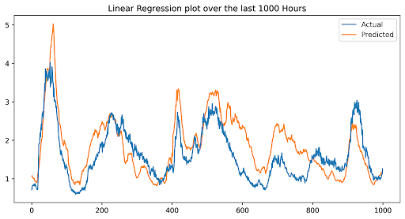
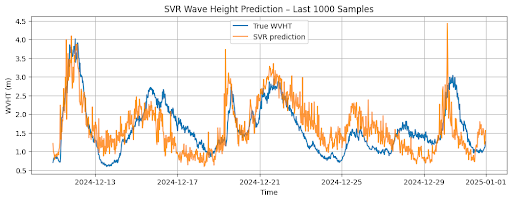
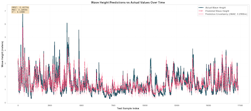
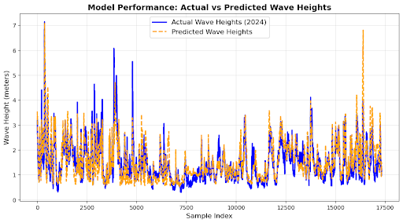

# Wave Height Estimation using Atmospheric Meteorological Data

This project explores machine learning models to estimate **significant wave height** using atmospheric data collected from NOAA buoys off the cost of Virginia Beach. The goal is to reduce reliance on expensive and unreliable intertial measurement units by predicting wave height from accessible meteorological measurements.

## Overview
Accurate wave height prediction is critical for:
- Marine engineering and vessel safety
- Offshore structures (wind turbines, oil platforms)
- Public safety during storms and hurricanes

We trained and evaluated several models:
- Linear Regression
- Support Vector Regression (SVR)
- Random Forest
- Long Short-Term Memory (LSTM) Neural Network

## Data
- Source: NOAA National Data Buoy Center (NDBC)
- Features: wind speed, air temperature, sea surface temperature, air pressure, day of year, time of day (encoded as sine/cosine)

## Results
- **Random Forest** achieved the best performance (R² ≈ 0.70) with fast training.
- **LSTM** showed competitive accuracy but required longer training times.
- **Linear Regression** provided a strong baseline with near-instant training.
- **SVR** underperformed relative to other models.

###Linear Regression

###Support Vector Regression

###Random Forest

###Long Short-Term Memory

